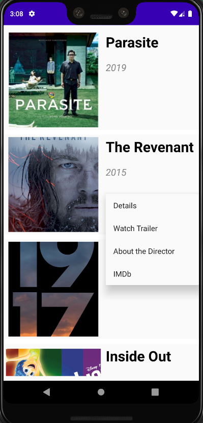
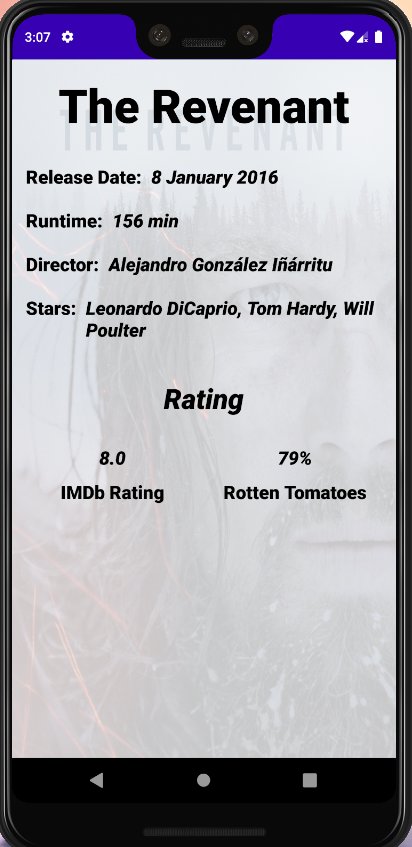
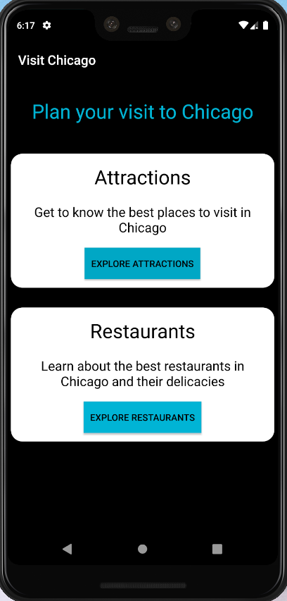
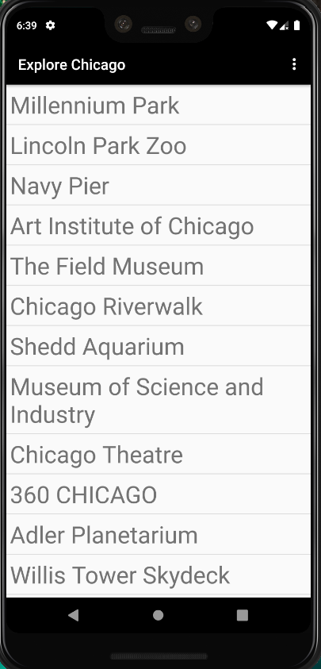

# Android Mini Projects

## [Movies4U](Movies4U/)

- This android application maintains a Database of movies and some movie info.
- Uses custom Adapter View and View recycler to implement the list view.
- The app contains a Menu displaying the list of Movies. Each movie has hyperlinks to check details of the movie, watch trailer, Imdb link, director wiki page.

 

- Each movie contains a details page with some info about the movie.

  

## [Travel Companion](TravelCompanion/)

- Two Android application (Client and Receiver/Server).
- Permission based broadcasting from the client app opens the Service App.
- Client App redirects to the service app, based on what kind of service the user clicks on (Attractions/Restaurants). The list of cities (Chicago in the basic version) can be easily extended

 

 

- The Service app shows a list of attractions/restaurants in the particular city based on the option selected in the Client App.
- This list can be extended vertically (hospitals etc.) and horizontally (more locations) with minimal effort.
- On click of a item, the user is redirected to the official website of the attraction/restaurant.

  

## [Music Service Client](MusicClient/)