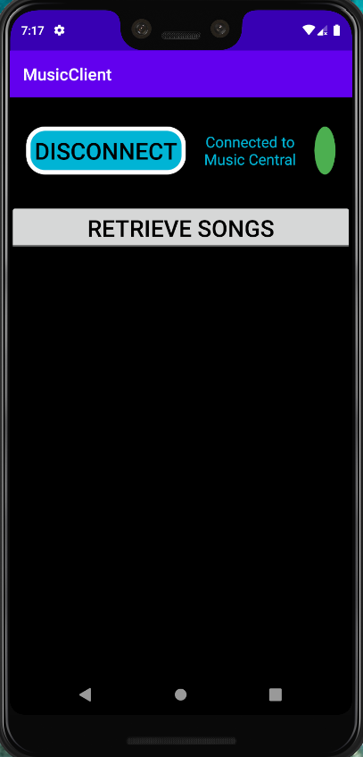
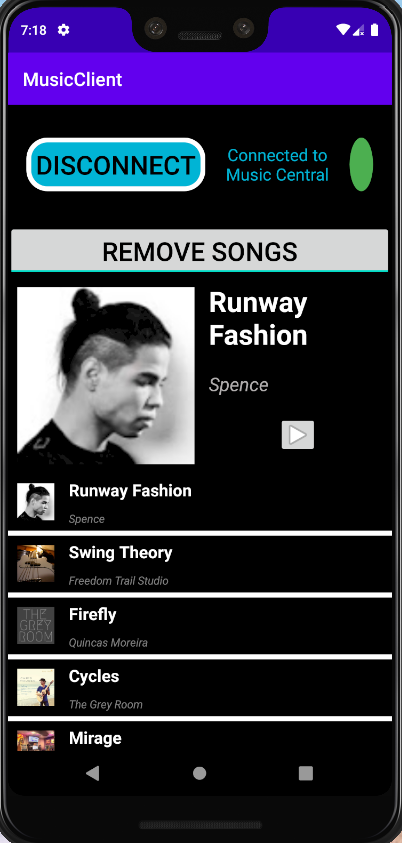

# Android Mini Projects

## **Versions Used**

Android: *Android 9* (API 28)

Android Studio: *3.6.1*

Emulated Device: *Google Pixel 3 XL*

 

## [Movies4U](Movies4U/)

- This android application maintains a Database of movies and some movie info.
- Uses custom Adapter View and View recycler to implement the list view.
- The app contains a Menu displaying the list of Movies. Each movie has hyperlinks to check details of the movie, watch trailer, Imdb link, director wiki page.

 

- Each movie contains a details page with some info about the movie.

  

## [Travel Companion](TravelCompanion/)

- Two Android applications (Client and Receiver/Server).
- Permission based broadcasting from the client app opens the Service App.
- Client App redirects to the service app, based on what kind of service the user clicks on (Attractions/Restaurants). The list of cities (Chicago in the basic version) can be easily extended

 

 

- The Service app shows a list of attractions/restaurants in the particular city based on the option selected in the Client App.
- This list can be extended vertically (hospitals etc.) and horizontally (more locations) with minimal effort.
- On click of a item, the user is redirected to the official website of the attraction/restaurant.

  

## [Music Service Client](MusicClient/)

- Two Android applications (Client and Server).
- Permission based broadcast service where the service app provides a music stream that can be fetched by the client to play once it is connected to the server. The Client uses Binding to stay connected to the service.
- The service app runs in the background.
- The Music client has two states, Connected and Disconnected. The client is able to retrieve the songs list along with info (from the service) only after it connects to the service.

Solarized dark             |  Solarized Ocean
:-------------------------:|:-------------------------:
  |  

 

- Once the Client connects to the service, it can play any song from the list returned.

